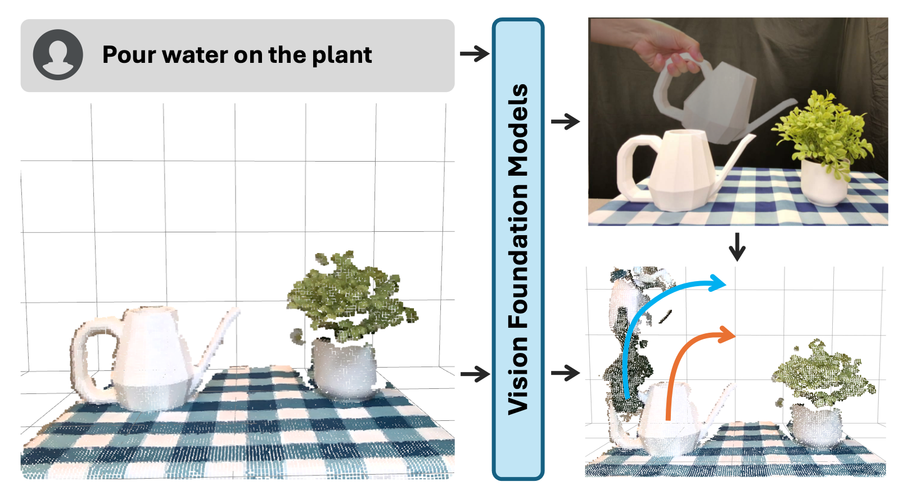
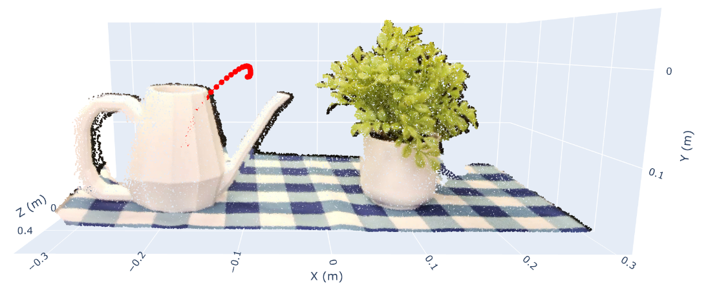

# Robotic Manipulation by Imitating Generated Videos (RIGVid)

[[Project Page]](https://rigvid-robot.github.io/)  [[Paper]]()  [[Video]]()

**Authors:** Shivansh Patel<sup>1</sup>, Shraddhaa Mohan<sup>1</sup>, Hanlin Mai<sup>1</sup>, Unnat Jain<sup>2,3*</sup>, Svetlana Lazebnik<sup>1*</sup>, Yunzhu Li<sup>4*</sup> (* denotes equal advising)

<sup>1</sup> University of Illinois Urbana-Champaign • <sup>2</sup> UC Irvine • <sup>3</sup> Skild AI • <sup>4</sup> Columbia University


<figure>
  
</figure>

---

## 📖 Overview

**RIGVid** (Robot Imitation from Generated Videos) extracts a 6‑DoF pose rollout of a moving object purely from a generated video.  Starting from a single RGB‑D observation, RIGVid:

1. **Predicts monocular depth** for every video frame using RollingDepth.  
2. **Extracts 6‑DoF poses** via FoundationPose: register on the first frame, then track through time.  
3. **Visualizes** the scene point cloud and object trajectory in an interactive Plotly viewer.

This demo code reproduces the pipeline end‑to‑end in the **camera frame**.

---

## 🏗 Installation

We provide an installation script that clones and installs both RollingDepth and FoundationPose in one environment:

```bash
git clone https://github.com/rigvid-robot/rigvid.git
cd rigvid
./install.sh      # creates and configures 'rigvid' conda env
```

Then activate:
```bash
conda activate rigvid
```
The installation will likely take some time, please be patient. 

---

## 🎬 Quick Demo

All required assets (generated video, RGB-D, masks, intrinsics) are in the `media/` folder.  Simply run:

```bash
python demo.py
```

If you wish to generate your own video, you have two options:
1. **Use the KlingAI API.** Code for querying is provided in `video_gen_query.py`. You'll need to obtain a [KlingAI API Key](https://app.klingai.com/global/dev/document-api/quickStart/productIntroduction/overview) and configure it via environment variables:
```
export KLING_API_ACCESS_KEY="YOUR_KLINGAI_KEY"
export KLING_API_SECRET_KEY="YOUR_KLINGAI_SECRET_KEY"
```
However, note that the cheapest API package currently costs $1400, as detailed [here](https://app.klingai.com/global/dev/document-api/productBilling/prePaidResourcePackage).

2. **Use the KlingAI web interface.** Navigate to the site, use the Kling V1.6 model in Professional Mode, and set a high creativity and relevance factor. Once the video is generated, download it manually.

- **Outputs** saved under `outputs/`:  
  - Depth maps, numpy arrays, and visualization videos  
  - 6‑DoF pose matrices in `outputs/fp_outputs/ob_in_cam/`  
  - Interactive HTML: `outputs/trajectory_visualization.html`


<figure>
  
  <figcaption>Interactive 3D view of scene point cloud + object trajectory.</figcaption>
</figure>

---

## 🏭 Real‑World Deployment
The following modifications need to be made for real-world deployment:
1. **Transform to world frame** using your camera extrinsics.  
2. **Smoothing** is crucial to avoid jerky motions.
3. **Retarget** poses to your robot’s end‑effector:
   ```python
   T_world_to_eef = T_world_to_object_smooth @ T_object_to_eef
   ```

---

## 📜 License & Acknowledgements

We build upon [RollingDepth](https://rollingdepth.github.io/) and [FoundationPose](https://nvlabs.github.io/FoundationPose/).  
